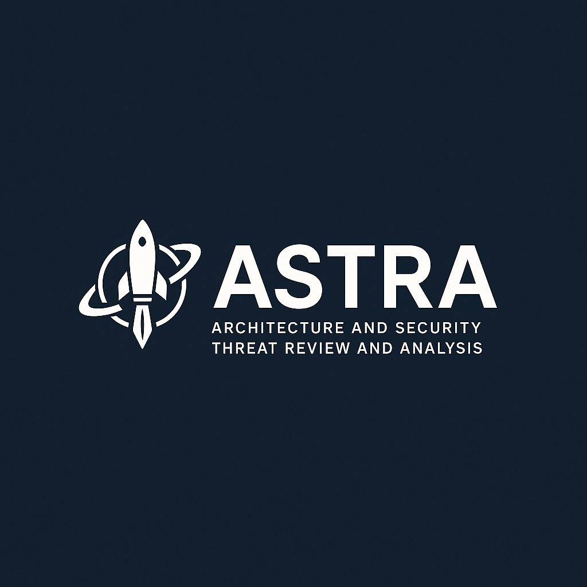

# ASTRA Threat Modeling and Security Architecture Review Framework

# ASTRA Practitioner’s Manual (Version 1.2.0)

---

## Personal Note and Dedication

ASTRA is dedicated to **Karen**, my fiancée, who continues to inspire me to seek the light, to fight the Dark Side, and to believe that clarity, collaboration, and resilience are forces for good — in both life and work.

This project is my way of giving back to the professional community I've been privileged to be part of — offering not just a tool, but the benefit of lessons learned over decades of real-world experience.

It is also a personal statement: in a time of economic uncertainty, layoffs, and shifting priorities, I choose to build. I choose to share. I choose to lead with integrity and clarity.

ASTRA is designed to assist all members of an organization—from leadership to frontline staff—in understanding and managing cybersecurity risks as an integral part of daily operations, beyond just meeting compliance requirements. They are responsibilities.

Thank you for taking the time to explore ASTRA. May you find it useful, practical, and — most importantly — a tool for doing good.

— **Steve Gibbons**

---

## 1. Philosophy and Background

ASTRA was shaped by over 25 years of real-world experience helping large organizations manage security risks, evaluate system designs, and respond to regulatory needs. It reflects lessons learned while supporting modernization efforts, vendor evaluations, and internal reviews at companies like Wells Fargo, American Express, and IBM.

These projects all had something in common: they were most successful when teams worked together to focus on what mattered most—protecting people, maintaining trust, and enabling smart, secure progress.

ASTRA’s core principles are built around that idea:

- **Governance Must Align to Reality**  
  Policies and controls should reflect how things actually work—not how we wish they did.

- **Third-Party Risk Cannot Be an Afterthought**  
  Vendors, platforms, and partners are part of your system too.

- **Architecture Reviews Must Prioritize Actionable Findings**  
  Reviews should lead to real improvements, not just paperwork.

- **Collaboration Outperforms Confrontation**  
  Security is a team sport; collaboration leads to better outcomes than blame.

- **Simplicity Eliminates Friction**  
  The easier a framework is to use, the more likely people are to actually use it.

- **Flexibility is Key to Scalability**  
  ASTRA is designed to grow with your team, your systems, and your challenges.
  
---

## 2. Introduction

**ASTRA** stands for *Architecture and Security Threat Review and Analysis*. It is a collaborative, business-focused approach to understanding risk in systems, processes, and technologies.

ASTRA-based evaluations are **not audits**. They are structured conversations designed to uncover assumptions, clarify uncertainties, and improve security—not to assign blame or generate audit findings.

ASTRA helps teams across the organization—including IT, legal, compliance, operations, and leadership—work together to:

- Understand how systems are expected to be used.
- Identify gaps, assumptions, and risks early.
- Clarify where safeguards are working—and where they’re missing.
- Recommend meaningful, achievable improvements.

ASTRA supports learning, improvement, and shared accountability. It uses simple templates and plain language to drive outcomes that are traceable, actionable, and easy to understand—even for those without a technical background.

You don’t need to be a cybersecurity expert to contribute. ASTRA helps teams ask the right questions, focus on what matters, and strengthen trust in the systems they rely on.

---

## 3. ASTRA Process Overview

The ASTRA process is structured to guide teams step-by-step from understanding the business need to delivering clear, actionable recommendations. Each phase builds on the last, supporting traceable outcomes and collaborative engagement.

| **Phase**   | **Purpose** |
|-------------|-------------|
| **Align**   | Understand the business context and goals. Gather key usage assumptions and any known constraints. |
| **Study**   | Review the technical design and system documentation—such as architecture diagrams, data flows, or vendor information. |
| **Target**  | Identify key risk areas to explore. Prepare interview questions and focus areas based on what matters most. |
| **Review**  | Conduct structured, collaborative interviews with subject matter experts and stakeholders to discover gaps, assumptions, or risks. |
| **Analyze** | Consolidate findings, assess risks, recommend mitigations, and finalize deliverables. Ensure results are practical and aligned with business priorities. |

This process encourages open discussion, avoids blame, and emphasizes improvement—not inspection or compliance policing. ASTRA is designed to meet teams where they are and help them move forward with clarity and confidence.

---

## 4. Work Products (Intermediary and Final)

ASTRA uses a set of structured tools and views to support the evaluation process. These work products are designed to be collaborative, traceable, and useful to both technical and non-technical stakeholders.

Some are used during the assessment (intermediary), while others support delivery and follow-up (final outputs). All are intended to make risk decisions easier—not harder.

| **Category**                             | **Work Product**                                | **Purpose** |
|------------------------------------------|------------------------------------------------|-------------|
| **Onboarding and Orientation Materials** | **Client-Facing Guide**                         | Optional onboarding guide that explains ASTRA’s structure, goals, and expectations in plain language. |
| **Discovery and Evaluation Tools**       | **Business Context Questionnaire**              | Documents how the system is expected to be used, who it serves, and key business assumptions. |
|                                          | **Technical Architecture Questionnaire**       | Captures the system’s design, key components, boundaries, and technologies. |
|                                          | **Emerging Risks Questionnaire**                | Optional supplement to explore new technologies, novel threats, or evolving concerns. |
|                                          | **Unified Working Spreadsheet**                 | The central record of all observations, assumptions, risks, action items, follow-ups, and to-dos. |
| **Reporting and Communication Deliverables** | **Risk Findings Table**                       | A filtered view of the Unified Spreadsheet that highlights discovered risks. |
|                                          | **Critical Action Items Table**                 | A focused view showing urgent, unresolved gaps that may block progress or increase risk. |
|                                          | **Administrative To-Do Log**                    | Tracks minor fixes, cleanup tasks, or documentation needs. Not considered blocking issues. |
|                                          | **Final Risk and Recommendations Report (Optional Template Available)** | A standalone or auto-generated summary that prioritizes risks and lists practical recommendations. See Section 4.1 for formatting guidance. |

These artifacts support transparency, help avoid surprises, and ensure findings can be communicated clearly across teams.

About “Auto-Generated” Reports

ASTRA’s Final Risk and Recommendations Report may be produced manually (e.g., written in Word or Markdown) or generated automatically from the Unified Working Spreadsheet by:
	•	Filtering the Risk Findings Table to show prioritized risks.
	•	Filtering the Critical Action Items Table to highlight unresolved blockers.
	•	Including contextual information from the Business Context and Architecture Questionnaires.
	•	Copying summaries and recommendations into a document for stakeholder review.

Teams may export these filtered views or use additional tooling to render:
	•	PDFs
	•	HTML reports
	•	Word documents
	•	Markdown summaries

ASTRA does not prescribe a required report format, but providing a clear, professional report ensures the results are accessible to both technical and non-technical audiences.

---

## 4.1 Report Format Guidance (Optional, but Recommended)

ASTRA does not prescribe a strict format for the final report, but providing a clear, professional document helps ensure results are accessible to both technical and non-technical audiences.

This section offers a recommended structure and formatting suggestions based on best practices.

### Recommended Report Structure

1. **Cover Page**  
   Include the report title, date, evaluation target, facilitator(s), and organization branding (if applicable).

2. **Table of Contents**  
   Provide clickable links and page numbers if supported by the chosen format (such as PDF or HTML).

3. **Executive Summary**  
   Summarize key findings, prioritized risks, and high-level recommendations suitable for leadership review.

4. **Evaluation Scope and Objectives**  
   Describe what was assessed, the purpose of the evaluation, and any exclusions or limitations.

5. **Business and Technical Context**  
   Summarize the system’s purpose, architecture, business goals, and constraints.

6. **Key Assumptions and Constraints**  
   List verified assumptions and any gaps in understanding that were identified during the evaluation.

7. **Risk Findings Summary**  
   Present a clear list or table of prioritized risks, including severity, likelihood, and RCID mapping.

8. **Critical Action Items**  
   Highlight unresolved blockers or open questions that require immediate attention.

9. **Administrative To-Do Items (Optional)**  
   List minor issues that do not block risk assessment or delivery but may require future attention.

10. **Appendices (Optional)**  
    Include supporting materials such as methodology notes, diagrams, glossary, or detailed findings.

### Suggested Export Formats

- **PDF** with clickable Table of Contents and page numbers for stakeholder readability.
- **Markdown or Word Document** for internal team collaboration and version control.
- **HTML** for publishing on internal portals or online sharing.

### Optional Enhancements

- Add organizational branding such as logos or consistent styling.
- Include a cover letter or executive briefing page summarizing key takeaways.
- Provide interactive dashboards or summary charts if supported by available tools.

This structure ensures that the final report communicates findings clearly while remaining flexible enough to meet various organizational needs.

---

## 5. Interview and Discovery Process

Interviews are the heart of the ASTRA process. They are designed to be open, collaborative conversations—not interrogations or audits.

The goal is to understand how things actually work, clarify expectations, and surface risks or assumptions that might otherwise go unnoticed.

### Key Interview Practices

- **Group Interviews Supported**  
  Interviews may include multiple subject matter experts (SMEs), architects, and business owners to capture different perspectives.

- **Attendance Mode Tracked**  
  Whether the session is in person, remote, or hybrid is recorded in the Meeting Logistics tab for context.

- **Attribution Tracked**  
  When possible, key insights, clarifications, or assumptions are linked to specific participants—this helps with follow-up and traceability.

- **Gap Owners Assigned**  
  Every Critical Action Item must have a clearly assigned owner to ensure accountability and resolution.

- **Collaborative Tone**  
  ASTRA interviews are improvement-focused and never adversarial. The emphasis is on shared understanding and positive change.

### 5.1 Supporting Tables Overview

In addition to recording risks and actions, ASTRA evaluations rely on three supporting tables to **track participation, document references, and stakeholder accountability**. These tables provide traceability, reduce ambiguity, and ensure teams can validate or follow up on sources of information used in the evaluation.

These tables are:

- **5.1.1 Interview Attendees Table** – Who participated in the evaluation sessions.
- **5.1.2 Referenced Stakeholders Table** – Who owns or is accountable for the system or identified risks.
- **5.1.3 Referenced Documents Table** – What documents or artifacts were used as inputs to the evaluation.

---

#### 5.1.1 Interview Attendees Table

The **Interview Attendees Table** documents all participants involved in the structured interviews or working sessions.

Each row should capture:

| **Field**          | **Purpose** |
|--------------------|-------------|
| **Attendees Code**  | Short identifier used in notes or records (e.g., SPG, JD). |
| **Name**            | Full name of the participant. |
| **Role/Department** | Internal or external role (e.g., Architect, Developer, Product Owner). |
| **Title**           | Job title if known. |
| **Employer**        | Participant's organization or company. |
| **Email**           | Contact email, if available. |
| **Phone**           | Contact phone number, if available. |
| **Via**             | How the participant attended (e.g., In Person, Zoom, Telephone). |

This table supports **traceability of insights** and clarifies who contributed to the evaluation.

---

#### 5.1.2 Referenced Stakeholders Table

The **Referenced Stakeholders Table** documents **key individuals or roles** responsible for the system, identified risks, or follow-up actions.

Each row should capture:

| **Field**              | **Purpose** |
|------------------------|-------------|
| **Person Code**        | Short identifier used in records (e.g., BB, VP). |
| **Name**               | Full name of the stakeholder. |
| **Role/Department**    | Their organizational role or department. |
| **Title**              | Job title, if known. |
| **Employer**           | Organization or company. |
| **Email**              | Contact email, if available. |
| **Phone**              | Contact phone number, if available. |
| **Via**                | How they were referenced (e.g., Org Chart, Interview, Document). |

This table **supports accountability** by linking risks and recommendations to the appropriate business or technical owners.

---

#### 5.1.3 Referenced Documents Table

The **Referenced Documents Table** tracks all supporting materials reviewed or referenced during the evaluation.

Each row should capture:

| **Field**                     | **Purpose** |
|-------------------------------|-------------|
| **Document Code**              | Short identifier (e.g., SAD, DFD). |
| **Document/Artifact/Resource** | Plain-language description of the artifact. |
| **Provided Artifact or Link (or N/A)** | Link or reference, or "N/A" if not provided. |
| **Version Evaluated**          | Document version or date reviewed. |
| **Also Known As**              | Alternate names, acronyms, or internal references. |
| **Maturity Level (Optional)**  | Self-assessed readiness (Low, Medium, High). See Diagram Sufficiency Appendix. |
| **Rarity**                     | Real-world prevalence (Common, Uncommon, Rare). |

This table supports **evaluation transparency** and **traceability** by clearly logging the informational sources used in the assessment.

---

By maintaining these supporting tables, ASTRA ensures that evaluations are **well-documented, defensible, and easy to revisit** for follow-up or future assessments.
---

### Meeting Logistics Tab

The `Meeting Logistics` tab captures essential information for each interview session:

- Meeting ID, Date, Time  
- Attendee Names and Roles  
- Meeting Format (Video, In-Person, Hybrid)  
- Interviewer Name(s)  
- Session Notes  

This helps maintain traceability and transparency throughout the evaluation.

---

### Main Tab Major Groupings

The main spreadsheet used during an ASTRA review includes the following **column groups** and **field names**:

| **Group**       | **Columns** |
|-----------------|------------|
| **General**     | Record ID, Source (Person or Document), Source Detail (Page/Section), Summary & Context |
| **Risk**        | Risk Context & Impact Domain, Severity\| Impact, Likelihood\| Frequency, Inherent Risk |
| **Remediation** | Treatment, Cost, Timeline, Difficulty, Mitigation Effectiveness, Residual Risk |
| **Resolve**     | Accountable Owner, Due Date, Status |

#### Column Group Descriptions

- **General**  
  Captures the **record identifier**, **source of information** (such as a person or document), specific **reference details** (such as page or section), and a **concise summary and context**.  
  This group supports **traceability** and **contextual understanding** of every record.

- **Risk**  
  Captures the **risk category** (Risk Context & Impact Domain), estimated **severity and impact**, **likelihood and frequency**, and the **inherent risk** before mitigation.  
  This group helps prioritize risks based on **impact and likelihood**.

- **Remediation**  
  Captures the **treatment strategy**, estimated **cost**, **timeline**, **difficulty**, and **mitigation effectiveness**, as well as the resulting **residual risk** after treatment.  
  This group supports **remediation planning** and helps teams understand the trade-offs involved.

- **Resolve**  
  Captures the **accountable owner**, **due date**, and current **status** of the record.  
  This group supports **ownership assignment**, **tracking**, and **follow-up** to ensure issues are addressed.
---

### Record Types

Each item in the spreadsheet is assigned a unique Record ID prefix that describes what it represents:

| **Record ID Prefix** | **Record Type**       |
|----------------------|-----------------------|
| `O-xxx`              | Observation           |
| `A-xxx`              | Assumption            |
| `R-xxx`              | Risk Finding          |
| `AI-xxx`             | Critical Action Item  |
| `TD-xxx`             | Administrative To-Do  |
| `FU-xxx`             | Follow-up Question    |

These identifiers help categorize the findings and support efficient tracking during and after the review.

---

## 6. Field Option Definitions

### Risk Context & Impact Domains (RCIDs)

Every ASTRA record must include a label that explains **why it matters**—not just what it is. These labels are called **Risk Context & Impact Domains (RCIDs)**.

RCIDs replace older, technical terms like "Business Impact Area" to better reflect ASTRA’s broader mission: helping both technical and non-technical teams understand real-world consequences.

---

### 6.1 Purpose and Scope

Not all risks are purely technical or financial. Some affect safety, legal exposure, trust, or the ability to meet long-term goals.

That’s why each RCID includes two dimensions:

- **Risk Context** – What kind of concern it is (e.g., legal, safety, operational).
- **Impact Domain** – Where the harm would show up if the risk materialized.

This structure supports better communication and helps ensure that risks are understood across roles—from engineers to executives.

---

### 6.2 RCID Categories

Each record must be assigned **exactly one** RCID. Use the best-fit category—even if multiple areas seem affected. If none clearly apply, use **Unclassified** and flag it for follow-up.

| **RCID**                        | **Description** |
|---------------------------------|-----------------|
| **Customer Safety / Human Harm** | Risks that could result in physical injury, adverse health outcomes, or safety violations. |
| **Privacy / PII / PHI**          | Loss or misuse of personal or health data, or any breach of privacy expectations. |
| **Financial Loss**              | Direct or indirect monetary harm (fraud, penalties, lost revenue, etc.). |
| **Reputation / Trust**          | Damage to brand reputation, public confidence, or customer loyalty. |
| **Regulatory / Legal Exposure** | Violations of laws, contracts, or regulations—including audits and lawsuits. |
| **Service Continuity / Availability** | Downtime, outages, or interruptions to core services. |
| **Data Integrity / Quality**    | Tampering, corruption, or errors that affect decision-making or operations. |
| **Unauthorized Access / Misuse** | Improper access, over-permissioning, or abuse of legitimate credentials. |
| **Internal Misuse / Insider Threat** | Accidental or intentional misuse by employees, contractors, or partners. |
| **Supply Chain / Vendor Impact** | Issues introduced by third-party tools, services, or relationships. |
| **Innovation / Product Roadmap** | Delays or disruptions to feature development, R&D, or strategic technology plans. |
| **Strategic or Mission Disruption** | Impacts to long-term goals, competitiveness, or organizational direction. |
| **Contextual**                   | Used for environmental notes, assumptions, or architectural details that don’t carry direct impact. |

> **Note:**  
> *Security* is not its own RCID. Instead, risks should be framed in terms of their **consequences** (e.g., loss of availability, privacy breach, safety concern).

---

### 6.3 Role in Evaluation

RCIDs are **not** severity scores. They’re narrative anchors used to:

- Route records to the right people (e.g., legal, compliance, architecture)
- Clarify why something matters—even before scoring is done
- Support clear prioritization and traceability

They make the ASTRA process more meaningful for non-technical stakeholders by connecting risk to real-world consequences.

---

### 6.4 RCID Mapping to Industry Standards

| **RCID**                          | **NIST/FIPS 199**         | **ISO 27005**                    | **FAIR**                          | **HITRUST/HIPAA**                  |
|----------------------------------|----------------------------|----------------------------------|-----------------------------------|------------------------------------|
| Customer Safety / Human Harm     | *(Not defined)*            | Personal safety (optional)       | *(Not explicit)*                  | Patient Safety, Device Failure     |
| Privacy / PII / PHI              | Confidentiality            | Personal Data Disclosure         | Privacy Violations                | PHI Disclosure                     |
| Financial Loss                   | *(Not explicit)*           | Asset Value, Fraud               | Fines, Response/Replacement Cost  | Financial Penalties, Cost of Breach|
| Reputation / Trust               | *(Not explicit)*           | Reputational Impact              | Reputation Damage                 | Loss of Public Trust               |
| Regulatory / Legal Exposure      | *(Implied under CIA)*      | Legal Obligations, Compliance    | Fines & Judgments                 | Audit Failure, Civil Penalties     |
| Service Continuity / Availability| Availability               | Operational Disruption           | Productivity Loss                 | Downtime, System Unavailability    |
| Data Integrity / Quality         | Integrity                  | Data Corruption                  | Loss of Integrity                 | Clinical Decision Risk             |
| Unauthorized Access / Misuse     | Confidentiality            | Misuse or Abuse of Privileges    | Primary Loss Event, Loss Frequency| Improper Access                    |
| Internal Misuse / Insider Threat | *(Not explicit)*           | Insider Misuse                   | Secondary Loss Event              | Workforce Misuse                   |
| Supply Chain / Vendor Impact     | *(Not explicit)*           | Third-Party Dependency Risk      | External Dependencies             | Third-Party Service Providers      |
| Innovation / Product Roadmap     | *(Not defined)*            | Business Strategy Impact         | Competitive Advantage Loss        | R&D Delay, Innovation Risk         |
| Strategic or Mission Disruption  | *(Not defined)*            | Strategic Objectives Impact      | Strategic Risk                    | Business Continuity Disruption     |

---

## 7. Findings, Action Items, Assumptions, Follow-Ups

ASTRA uses structured record types to organize discoveries made during the evaluation. These types were introduced in Section 5 and are summarized below for reference.

| **Record ID Prefix** | **Record Type**         | **Summary Purpose** |
|----------------------|-------------------------|----------------------|
| `O-xxx`              | **Observation**          | Informational notes or helpful context. No immediate action required. |
| `A-xxx`              | **Assumption**           | An unconfirmed expectation, dependency, or usage pattern. |
| `R-xxx`              | **Risk Finding**         | A confirmed threat, gap, or vulnerability. |
| `AI-xxx`             | **Critical Action Item** | A missing or unclear element that must be resolved to complete the review. |
| `TD-xxx`             | **Administrative To-Do** | Minor clean-up or non-blocking documentation fix. |
| `FU-xxx`             | **Follow-up Question**   | A clarification request for stakeholders or SMEs. |

> For full definitions, see Section 5: Interview and Discovery Process.

---

### Record Lifecycle and Interactions

This section focuses on how these records relate and evolve during the evaluation:

- **Assumptions** and **Observations** typically start in `Confirm` status. Once verified, they may stay as-is or lead to additional findings.
- **Critical Action Items** must be resolved or reassigned. If not resolved, they are escalated to **Risk Findings**.
- **Follow-up Questions** are used to track open threads and should result in updates, clarification, or conversion to another record type (such as `A-`, `R-`, or `AI-`).
- **Administrative To-Dos** are logged for awareness and should not block evaluation closure.

This structure supports traceability, accountability, and collaboration—without the blame-oriented tone common in audit frameworks. It ensures nothing important gets lost in the shuffle.
---

## 8. Risk Prioritization and Scoring

ASTRA uses structured scoring to help teams prioritize which risks need attention, how urgently, and how difficult they will be to address. These scores help focus resources where they matter most.

Each risk is assessed using the following elements:

| **Element**         | **Definition** |
|---------------------|----------------|
| **Severity**        | How serious the consequences would be if the risk happens. |
| **Likelihood**      | How likely it is that the risk could occur. |
| **Inherent Risk**   | Combined impact and likelihood before any mitigations are applied. |
| **Cost**            | Rough estimate of financial or resource cost to fix the issue. |
| **Timeline**        | How long it would take to implement a fix. |
| **Difficulty**      | How complex or challenging the fix is (technically or organizationally). |
| **Mitigation Impact** | How effective the proposed fix is likely to be. |
| **Residual Risk**   | Risk that remains even after the fix is applied. |

---

### Risk Matrix

The matrix below shows how **Severity** and **Likelihood** combine to form a risk rating:

| **Severity / Likelihood** | **Low**   | **Medium** | **High**    |
|---------------------------|-----------|------------|-------------|
| **Low**                   | Minimal   | Low        | Medium      |
| **Medium**                | Low       | Medium     | High        |
| **High**                  | Medium    | High       | Critical    |
| **Critical**              | High      | Critical   | Showstopper |

---

### Risk Rating Levels

Each risk receives a rating from **Minimal (0)** to **Showstopper (5)**. These levels help define the urgency and expected response.

| **Category**     | **Level** | **Description**                                                                                 | **Response Guidance**                  | **Default Treatment Timeframe**  |
|------------------|-----------|--------------------------------------------------------------------------------------------------|-----------------------------------------|----------------------------------|
| **Minimal**       | 0         | No meaningful risk. Logged for visibility only.                                                  | No action needed                        | None                             |
| **Low**           | 1         | Minor risk with low impact or likelihood.                                                        | Accept, monitor, or defer               | Next review cycle (e.g., quarterly) |
| **Medium**        | 2         | Moderate impact or uncertainty. Might cause inefficiencies or minor failures.                   | Mitigate or monitor                     | Within 30–90 days                |
| **High**          | 3         | Significant potential harm (e.g., downtime, data exposure, legal risk).                         | Prioritize for remediation              | Within 30 days                   |
| **Critical**      | 4         | Major impact or high certainty. Legal, financial, or operational damage likely.                 | Immediate mitigation or escalation      | Within 7 days                    |
| **Showstopper**   | 5         | Unacceptable risk. Serious harm, safety issues, or regulatory exposure imminent.                 | Executive intervention required         | 24–48 hours max                  |

---

### Risk Treatment Strategies

ASTRA allows risks to be tagged with a **Treatment Strategy**—a high-level plan that explains what the team intends to do with it.

| **Treatment Strategy**             | **Description** |
|-----------------------------------|-----------------|
| **Avoid**                         | Eliminate the risk entirely (e.g., cancel a feature, remove the component). |
| **Mitigate (Reduce Likelihood)**  | Add controls to make the risk less likely to occur (e.g., access restrictions, testing). |
| **Mitigate (Reduce Impact)**      | Reduce the consequences if it does happen (e.g., backups, failover plans). |
| **Mitigate (Partial + Accept Residual)** | Address what’s feasible and accept the remaining risk formally. |
| **Accept**                        | Acknowledge the risk without taking immediate action—often for low-impact items. |
| **Transfer (Insurance)**          | Use insurance or similar financial tools to offset potential damage. |
| **Transfer (Contractual)**        | Assign responsibility to a third party via agreements or SLAs. |
| **Monitor Only**                  | Watch the risk, but defer action—often used for emerging risks or uncertainty. |
| **Escalate**                      | Forward to leadership or governance for funding, prioritization, or decision. |
| **Defer**                         | Delay action temporarily—often until a redesign or related dependency is addressed. |
| **Retire**                        | Risk is no longer relevant (e.g., system decommissioned, threat no longer applies). |

Use the `Risk Treatment Strategy` column in the ASTRA spreadsheet to tag each risk with one of these options. Additional context can be added in a `Treatment Notes` field if needed.

---

### ⚠️ Methodological Disclaimers on Risk Scoring

#### About Risk Scoring with Ordinal Values

ASTRA uses qualitative or *ordinal* scales such as **Low**, **Medium**, **High**, and **Critical** to estimate risk severity, likelihood, and overall priority.  
While these scales are widely used across the industry for their simplicity and accessibility, they have **mathematical limitations**:

- **Ordinal scales are rankings, not numerical values**. You cannot assume that "High" is exactly twice as severe as "Medium," nor can you perform mathematically valid operations like multiplying or averaging these values.
- **Aggregation and Distance Issues**: There is no universally accepted way to determine whether, for example, fixing ten "Low" risks is better or worse than fixing one "High" risk.  
  This is because ordinal scales **lack proportional or distance-based meaning**.
- **Rare but High-Impact Events**: Simple ordinal methods may **underrepresent rare, catastrophic risks** (so-called "black swan" events) because they rely on generalized scoring without probability distributions.

#### About Risk Matrices and Multiplicative Scoring

ASTRA’s risk matrix multiplies **Severity × Likelihood** to produce an overall priority score.  
While this matrix is a useful communication tool, **it should not be interpreted as a mathematically precise calculation**.

- Multiplying ordinal values does not yield true risk magnitude, only a *relative prioritization* for discussion and planning purposes.
- These scores are best used as **guidance**, not as definitive or absolute measures of risk.
- Teams should avoid over-relying on these scores for budgetary or legal justifications without further quantitative analysis.

For teams seeking greater rigor, see **Appendix: Advanced Risk Quantification Alternatives**.

---

## 9. Status Definitions

Each item recorded in the ASTRA spreadsheet—whether it's a risk, assumption, action item, or question—must have a **status** that reflects where it stands in the review process.

These status values support visibility, accountability, and traceability without adding unnecessary complexity.

| **Status**           | **Meaning** |
|----------------------|-------------|
| **Confirm**          | Needs clarification or verification. Common for observations or assumptions that haven’t yet been confirmed. |
| **Open**             | Actively tracked. Accepted into the working set for follow-up, review, or resolution. |
| **In Progress**      | Someone is currently working on the item or addressing the issue. |
| **Closed**           | Fully resolved. No further action needed. Applies to all record types. |
| **Deferred**         | Still relevant, but intentionally postponed. Will be reviewed again later. |
| **Promoted to Risk** | The item (typically a follow-up or action item) was escalated into a formal Risk Finding because of new information or missed resolution. A new `R-xxx` record is created to track it.

> **Note:** All records in the ASTRA working spreadsheet require a status value.  
> The default status for Observations and Assumptions is typically **Confirm**.

Status values help teams avoid dropped threads, highlight what's in motion, and support clean transitions between planning, analysis, and remediation.

---

## 10. Escalation Rules

ASTRA is designed to surface issues early, track them clearly, and escalate only when necessary. Escalation paths help ensure that unresolved or blocking items don’t fall through the cracks.

| **Scenario**                          | **Escalation Outcome** |
|--------------------------------------|-------------------------|
| **Critical Action Item remains unresolved** | Escalate to a **Risk Finding** (`R-xxx`). Assigned a severity based on updated understanding. |
| **Follow-Up Question remains unanswered**   | May escalate to an **Assumption** or **Risk** depending on relevance and impact. |
| **Administrative To-Do remains open**       | Logged for reference. Not considered blocking and does **not** prevent final reporting. |

Escalation is not about blame—it’s about visibility. It ensures that serious or unresolved issues are tracked appropriately and that the right people are brought in to help move things forward.

---

## 11. Visual Flows

These simple diagrams show how ASTRA captures information during interviews and how risks are prioritized during analysis. They are designed to help both technical and non-technical stakeholders understand ASTRA’s process at a glance.

---

### Interview and Discovery Flow

This diagram shows how different types of information gathered during interviews are categorized into ASTRA record types:

Discovery  
- Observation Identified → O-xxx (Observation)  
- Assumption Identified → A-xxx (Assumption)  
- Follow-Up Identified → FU-xxx (Follow-up Question)  
- Risk Identified → R-xxx (Risk Finding)  
- Missing Info Identified → AI-xxx (Critical Action Item)  
  - If Resolved → No Impact  
  - If Unresolved → Becomes Risk Finding (R-xxx)

Notes:  
- Observations and Assumptions typically begin in `Confirm` status.  
- Follow-Up Questions ensure clarity and traceability.  
- Critical Action Items must be resolved or escalated to Risk Findings.

---

### Risk Assessment Flow

This diagram outlines the step-by-step process used to evaluate and prioritize risk:

Estimate Severity  
↓  
Estimate Likelihood  
↓  
Calculate Inherent Risk  
↓  
Estimate Cost / Timeline / Difficulty  
↓  
Estimate Mitigation Impact  
↓  
Estimate Residual Risk  
↓  
Assign Risk Priority and Treatment

Each step builds on the previous one to help teams understand the nature of a risk, evaluate response options, and decide how to act.

---

These visual flows can be reused in onboarding sessions, workshops, or executive summaries to communicate ASTRA’s logic without relying on spreadsheets or specialized terminology.

---

## 12. Client Communication Philosophy

ASTRA is designed to support open, constructive, and professional communication throughout the evaluation process. This includes not just how findings are documented—but how they are presented and discussed with stakeholders.

The tone, framing, and delivery of ASTRA outputs should be clear, respectful, and free of unnecessary jargon or alarmist language. The goal is to build trust and enable smart decisions—not to assign blame or create friction.

---

### Principles for Clear, Inclusive Communication

- **Avoid overly technical language**  
  Use plain language wherever possible. If technical terms must be used, briefly define them or provide context.

- **Focus on outcomes, not just issues**  
  Explain *why* a risk matters in business terms—e.g., “could delay onboarding” or “may result in reputational damage.”

- **Don’t dramatize**  
  Phrases like “catastrophic breach” or “malicious actor” can alienate audiences. Stay grounded in facts and potential impacts.

- **Emphasize collaboration**  
  Make it clear that findings are meant to support improvement—not to call out failure.

- **Reinforce shared responsibility**  
  Security and risk management are team efforts. Avoid language that makes them sound like the responsibility of just IT or audit teams.

- **Adapt based on audience**  
  Executives, developers, legal teams, and operational staff all have different priorities. Tailor delivery to match what matters to them.

---

ASTRA deliverables are most effective when they engage the audience, clarify the risk, and support forward movement. Every communication should reflect that purpose—whether it’s a spreadsheet, a workshop, a report, or a hallway conversation.

---

## 13. Common Mistakes and Pitfalls

Even experienced teams can fall into traps that reduce the effectiveness of risk evaluations. This section outlines common issues seen in early or poorly scoped ASTRA reviews—and how to avoid them.

---

### Trying to Cover Too Much at Once

Overly broad evaluations lead to shallow findings and participant fatigue.

**What to do instead:**  
Start with a focused scope—one system, one integration, or one business process. Expand only when the core analysis is complete.

---

### Confusing Interviews with Audits

If participants feel they are being tested or judged, they may withhold information or go quiet.

**What to do instead:**  
Set expectations clearly. Interviews are collaborative sessions, not compliance checks. Frame questions to invite insight, not blame.

---

### Writing Down Everything

Treating the ASTRA spreadsheet like meeting notes clutters the record and dilutes real findings.

**What to do instead:**  
Record only what is material to risk evaluation, decision-making, or follow-up. Context is useful—noise is not.

---

### Over-Scoring Everything

Not every issue needs to be scored or treated as a formal risk.

**What to do instead:**  
Use scoring for significant or uncertain risks. Use Observations, Assumptions, or Administrative To-Dos for informational items or minor gaps.

---

### Ignoring Residual Risk

If you don’t estimate what risk remains after mitigation, decisions may be overly optimistic or incomplete.

**What to do instead:**  
Always document residual risk—especially when mitigations are partial, deferred, or dependent on future actions.

---

### Failing to Assign Ownership

Findings without owners often don’t get resolved.

**What to do instead:**  
Every Action Item and Risk should have a named owner—even if that owner later reassigns it. Accountability enables progress.

---

### Misusing the Framework

ASTRA is not a substitute for vendor assessments, pen tests, or policy reviews. It’s one piece of a healthy security and risk program.

**What to do instead:**  
Use ASTRA when architectural, business, or system-level clarity is needed—and when collaboration across teams is essential.

---

Being aware of these pitfalls helps teams get the most value from ASTRA without overcomplicating the process.

## 14. Practitioner Tips and Habits

Experienced ASTRA facilitators often develop habits that make the process smoother, more inclusive, and more effective. These tips are based on real-world use and are meant to help you avoid friction and build trust.

---

### Start with Listening, Not Scoring

Don’t rush to label every statement as a risk. Give participants space to explain before jumping to categorization.

---

### Track Open Threads Immediately

When someone says, “I think X, but I’m not 100% sure,” log it as an **Assumption** or **Follow-Up** right away. These are often early signals of deeper risks.

---

### Write Findings in Plain Language

Avoid jargon, acronyms, or internal shorthand. Every entry should be understandable to someone outside your team—especially executives or legal reviewers.

---

### Use the Summary and Details Field Effectively

Summaries should be concise and scannable. Use the rest of the field to include relevant context, reasoning, and clarifications that help others understand the concern.

---

### Don’t Fixate on Scoring Precision

Scoring is useful, but it’s more important to drive conversation and action than to debate whether a likelihood is “Medium” or “High.” Choose the best-fit score and move on.

---

### Show the Matrix When Needed

Sometimes, walking through the risk scoring matrix during the session helps participants better understand what you’re asking—and why it matters.

---

### Use the “Promoted to Risk” Status

If something starts as a Follow-Up or Action Item and clearly becomes a risk, promote it. This shows traceability and avoids duplicate records.

---

### Revisit Open Items Before Finalizing

Before wrapping up the evaluation, scan the spreadsheet for unresolved **Confirm** statuses, **Follow-Ups**, and **Action Items**. These often reveal what still needs attention.

---

### Use Administrative To-Dos Thoughtfully

Don’t bury real risks under “cleanup” items. If something could cause harm or confusion, escalate it appropriately.

---

### Share the Philosophy Early

Remind participants: this isn’t an audit. ASTRA is about shared understanding, trust, and improvement—not punishment. Set that tone up front.

---

Small habits like these reinforce ASTRA’s collaborative nature and help ensure that evaluations stay productive, focused, and fair.

## 15. Acknowledgments

ASTRA is the result of decades of field experience, collaboration, and iteration. While it was authored by a single practitioner, it stands on the shoulders of countless conversations, shared lessons, and hard-won insights.

Special thanks to the security architects, risk managers, product owners, developers, auditors, privacy officers, and legal professionals who asked the hard questions—and shared the real challenges they were facing.

This framework would not exist without the mentors who shaped my thinking, the colleagues who challenged it, and the teams who trusted me to help.

To every practitioner who believes that clarity, collaboration, and context are more powerful than fear or formality: ASTRA is for you.

## 16. Licensing and Use

This manual is published under the **Creative Commons Attribution 4.0 International (CC BY 4.0)** license.  
You are free to use, adapt, and share this material—with appropriate credit.

> **Attribution:**  
> “ASTRA Threat Modeling and Security Architecture Review Framework, developed by Steve Gibbons.”

For licensing details, see: [https://creativecommons.org/licenses/by/4.0/](https://creativecommons.org/licenses/by/4.0/)

---

## Appendix: Provided Templates

The following templates are included with this release:

- **Unified Working Spreadsheet Template**  
  (Includes main assessment tracker, meeting log, and analysis views)

- **Business Context Questionnaire Template**  
  (Captures business assumptions, mission alignment, and stakeholder expectations)

- **Technical Architecture Questionnaire Template**  
  (Captures design assumptions, dependencies, and system boundaries)

- **Quick Guide to Spreadsheet Usage**  
  (Reference sheet for column definitions, record types, and scoring guidance)

---

# Appendix: Advanced Risk Quantification Alternatives

---

## Overview

For teams seeking **greater mathematical rigor** than qualitative or ordinal scoring methods provide, ASTRA recommends the following **optional advanced techniques**:

### Probability Ranges

- Replace "Low," "Medium," or "High" likelihood with **estimated probability ranges**, such as "5–15% chance per year."
- This provides a more defensible and transparent basis for evaluating risk likelihood.

### Monte Carlo Simulations and Loss Exceedance Curves

- Use **Monte Carlo simulations** to run thousands of random trials based on defined risk variables.
- Generate **Loss Exceedance Curves** to visualize the probability of different levels of impact.
- This approach captures rare but extreme risks and supports sound aggregation across multiple risks.

### FAIR Model (Factor Analysis of Information Risk)

- Use the **FAIR framework** for structured, quantitative risk assessment based on:
  - Loss Event Frequency
  - Probable Loss Magnitude
- Produces financially oriented outputs suitable for executive decision-making.

---

## Recommended References

- *How to Measure Anything in Cybersecurity Risk* by Douglas W. Hubbard and Richard Seiersen
- *The Metrics Manifesto* by Richard Seiersen
- FAIR Institute: [https://www.fairinstitute.org](https://www.fairinstitute.org)

---

## Optional Use in ASTRA

These advanced methods are **not required** to perform an ASTRA review.  
They are **optional enhancements** for teams seeking to:

- Strengthen the defensibility of their risk assessments
- Capture rare or extreme risk scenarios
- Align risk outputs with financial or regulatory decision-making

---

# Appendix: Diagram Sufficiency Criteria

## Overview

ASTRA does not prescribe a single diagramming style or tooling preference.  
However, **reviewers and readers must be able to understand** how the diagram supports the evaluation's objectives.

This appendix provides **reviewer prompts**, a **statement template**, and **maturity level descriptions** to help teams assess and explain diagram sufficiency.

---

## Reviewer Prompts

Use these questions to assess whether the included diagram(s) are fit-for-purpose:

1. **Purpose Alignment**  
   - Does the diagram support the evaluation’s stated scope and goals?

2. **Stakeholder Relevance**  
   - Can both technical and non-technical audiences understand the key elements?

3. **Boundary Clarity**  
   - Are system boundaries and trust zones clearly shown?

4. **Data Flow Visibility**  
   - Are key data inputs, outputs, and flows represented?

5. **External Entity Representation**  
   - Are external systems, users, or partners identified?

6. **Threat Surface Coverage**  
   - Does the diagram expose interaction points where risk could emerge?

7. **Level of Detail Justification**  
   - Why was this level of detail chosen? What would be gained or lost by adding more?

8. **Traceability to Risk Records**  
   - Can risks identified in the evaluation be mapped back to diagram elements?

---

## Example Sufficiency Statement

Consider adding a short statement like the following when presenting a diagram:

> _“This diagram presents the system’s boundary, external entities, and primary data flows at a level sufficient for cross-functional risk prioritization. While lower-level technical details are not shown, this representation supports business, security, and operational alignment for the scoped evaluation.”_

---

## Diagram Maturity Levels

Use the table below to self-assess the level of diagram maturity provided:

| **Level** | **Characteristics** |
|----------|---------------------|
| **Low**  | High-level only (e.g., single box labeled "Platform"). Missing data flows, boundaries, or external entities. Adds little value to risk assessment. |
| **Medium** | Clear boundaries, external entities, and data flows. Sufficient for identifying trust zones, threat surfaces, and risk prioritization. |
| **High**  | Layered views (e.g., physical, logical), trust zones, detailed system interactions, and data classifications. Supports advanced modeling and simulation. |

> **Note:**  
> A **Medium** level diagram is generally **sufficient** for most ASTRA evaluations unless otherwise justified.

---

Teams are encouraged to document **why their diagram is sufficient** using these prompts, templates, or levels. This supports reviewer understanding and stakeholder confidence in the evaluation’s scope and coverage.

---

For updates, tools, or additional guidance, visit the ASTRA project homepage:  
[https://github.com/steve-gibbons/astra-threat-modeling-framework](https://github.com/steve-gibbons/astra-threat-modeling-framework)

# End of ASTRA v1.2.0 Practitioner’s Manual
